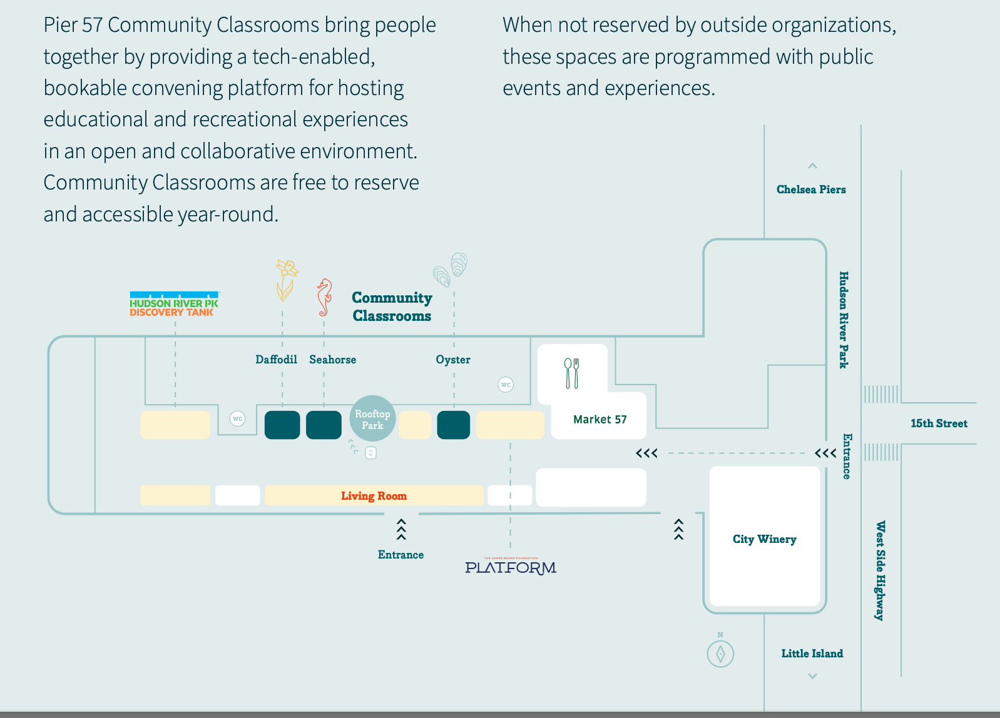

# Decision Trees and Random Forests

## Agenda
0. Remind me to start recording. 
0. In-Person Class Details. [5min]
0. Pre-Class HW [Quiz](https://forms.gle/tWgpj6r8B3TtKPbo8) [10min]
0. Review last weeks HW. [15min]
0. Update your fork
	* `git fetch upstream`
	* `git merge upstream/main`
	* `git push`
0. Check-In about [Engagement Best Practices](https://docs.google.com/presentation/d/1ovV1kSQBwY5NXKKWPaLhdxN2Df0X-fPLgn1uodu6XC8/edit?usp=sharing) [5min]
0. Decision Trees and Random Forests [Google Slides Lecture](https://docs.google.com/presentation/d/13JKGDp5d6Fb124jVQRSS99c_ZU1i9qsncp6gpxgqxww/edit#slide=id.p) [35min]
0. Break
0. Live coding lecture [20min]
0. Breakout Rooms

## In-Person Classes Details
* Week 11 [Nov Tue 11/14 - Fri 11/17] IN PERSON
* _Week XX [Nov 21 - 24] no class at all._
* Week 12 [Nov Tue 11/28 - Dec Fri 12/01] IN PERSON

All of our in-person classes this semester will held at the [Google Community Classrooms @Pier 57](https://pier57nyc.com/community-spaces/community-classrooms/) in the **Daffodil Classroom**.
- Address: [25 11th Ave New York, NY 10011](https://maps.app.goo.gl/wfp7hfSLok3i6Rsb9)  (On the far west side, in Chelsea-ish // Approx 11th AVE and 15th Street)
- Logistics: Students are to arrive 15 mins early.  No check-in needed, classes will be open upon arrival.
- Professionalism: please review our guide ([Industry Partner Interaction: Student Guide](https://docs.google.com/document/d/1_2c9joKkfP4RYM6_tIwWp8ngyeyndDxvVQFMFu0AN4w/edit)) on expectations on how to interact with CTP industry partners!
- Entrance: Enter through the doors between West Side Highway and 15th Street directly adjacent to the City Winery.

##### Very cool example of visualizing decision trees
[A visual introduction to machine learning](http://www.r2d3.us/visual-intro-to-machine-learning-part-1/)

## Homework

### Exercise HW
* HW is the `Exercise-DONT-EDIT-MAKE-COPY.ipynb`
* Make a copy of that file.  Change the file name to be `Exercise-YOUR-INITIALS.ipynb`
* Make all your edits in that file and add, commit, and push that file to github. 

### Pre-Class HW
0. Watch the [TFIDF](https://www.youtube.com/watch?v=OymqCnh-APA&ab_channel=ritvikmath) [~10min]
0. Watch the [StatQuest Word Embeddings video](https://www.youtube.com/watch?v=viZrOnJclY0&ab_channel=StatQuestwithJoshStarmer) [~20min]
0. As always, respond to the slack message with one thing you learned that has not been mentioned yet.  
0. There will be a short quiz on the pre-class material. 

