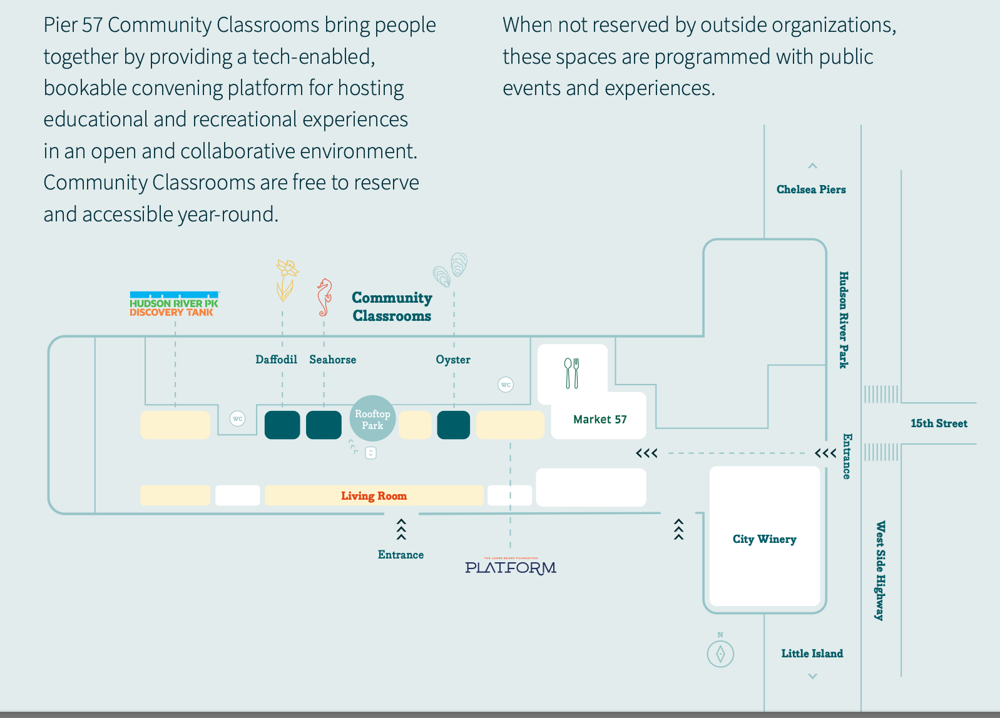

# Week 08 - NLP aka Natural Language Processing

## Agenda
0. Remind me to start recording. 
0. Scheduling for the 2nd meeting (mock behaviorals) is open! Check out details in your Career Coach’s channel/appointment link.
0. General reminder to check [#announcements](https://ctp2023.slack.com/archives/C05E6G6A0F3/p1698238800734259) every week. 
0. If you land a job, you have to [fill out this form](https://forms.gle/iCHvMDLAvvdJYRpd7).  
0. In-Person Class Details. [2min]
0. Review last weeks HW. [10min]
0. Update your fork
	* `git fetch upstream`
	* `git merge upstream/main`
	* `git push`
0. NLP Lecture: [Link](https://docs.google.com/presentation/d/13LwEmAoQOmAqqjM5t8L8Gtjr-urzyw37km8ppHrAbdU/edit?usp=sharing) [20-30min]
0. Break [5min]
0. Lecture Coding [20min]
0. TEAM Breakout Rooms [30min]
0. [Future of DS](https://docs.google.com/presentation/d/10AyrWpWA0_XceZ70w8LxZY4pm0JPCfWPTWMLFbSyl6M/edit#slide=id.p) [15min]

## Homework due next week 
1. The `Exercise-NLP.ipynb` file.  Please change the name of the file to `Exercise-[YOUR INITIALS].ipynb` [~20min]
2. VERY IMPORTANT!! Pre-Class work 
	* Watch [Getting Started with HuggingFace video](https://www.youtube.com/watch?v=QEaBAZQCtwE&ab_channel=AssemblyAI) [15min]
	* [~1-2hrs] Start the [HuggingFace NLP Course](https://huggingface.co/learn/nlp-course/chapter0/1?fw=pt) by completing the first two sections.  Part 0 and Part 1. I recommend doing the entire course, but that is up to you, however, you MUST DO PART 0 and PART 1.  
		* [Part 0: Setup / Intro](https://huggingface.co/learn/nlp-course/chapter0/1?fw=pt)
			* I HIGHLY RECOMMEND FOLLOWING ALONG IN google colab, AND NOT TRYING TO INSTALL/RUN LOCALLY.
		* [Part 1. Transformer Models](https://huggingface.co/learn/nlp-course/chapter1/1?fw=pt)
			* Complete and record your score of the End-of-chapter quiz
		* If youre having trouble, here are [live coding sessions](https://huggingface.co/learn/nlp-course/events/1?fw=pt) that might help.
		* If you do decided to do more, i would focus on section [PART 3: FINE-TUNING A PRETRAINED MODEL](https://huggingface.co/learn/nlp-course/chapter3/1?fw=pt). 

## In-Person Classes Details
* Week 11 [Nov Tue 11/14 - Fri 11/17] IN PERSON
* _Week XX [Nov 21 - 24] no class at all._
* Week 12 [Nov Tue 11/28 - Dec Fri 12/01] IN PERSON

All of our in-person classes this semester will held at the [Google Community Classrooms @Pier 57](https://pier57nyc.com/community-spaces/community-classrooms/) in the **Daffodil Classroom**.
- Address: 25 11th Ave New York, NY 10011
- Logistics: Students are to arrive 15 mins early.  No check-in needed, classes will be open upon arrival.
- Professionalism: please review our guide ([Industry Partner Interaction: Student Guide](https://docs.google.com/document/d/1_2c9joKkfP4RYM6_tIwWp8ngyeyndDxvVQFMFu0AN4w/edit)) on expectations on how to interact with CTP industry partners!
- Entrance: Enter through the doors between West Side Highway and 15th Street directly adjacent to the City Winery.

